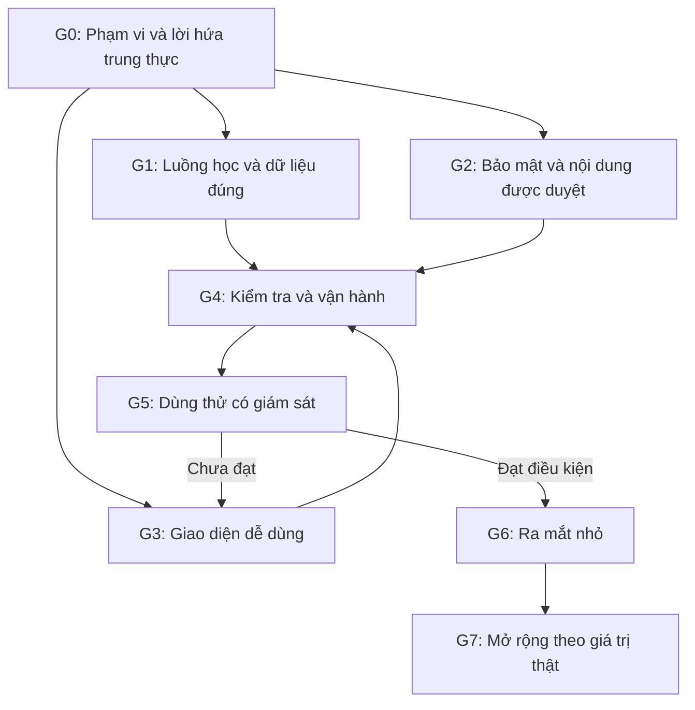

# Hồ sơ cải tiến KidsSafe AI

**Rà soát mới nhất theo yêu cầu liệt kê thiếu sót:** [07-THIEU-SOT-CON-LAI.md](07-THIEU-SOT-CON-LAI.md), gồm 5 phép thử bổ sung và danh sách điều kiện còn thiếu. Tài liệu 06 mô tả đợt sửa trước, không thay thế phát hiện mới ở 07.

Mục tiêu: phục vụ cộng đồng bằng sản phẩm giáo dục an toàn dễ dùng, trung thực và đáng tin. Trạng thái mới nhất ở [Tổng hợp và sửa lỗi sau cả ba tài liệu](06-TONG-HOP-VA-SUA-LOI.md); tài liệu 03 đã cập nhật giao diện đang chạy. 01/04/05 giữ lịch sử các đợt trước. Chưa hoàn tất toàn bộ workflow hoặc sẵn sàng phát hành.

Đọc theo thứ tự:

1. [Workflow ra mắt cộng đồng](02-WORKFLOW-RA-MAT-CONG-DONG.md) — phạm vi, chặng, phụ thuộc, vai trò, điều kiện nghiệm thu và kế hoạch 10 ngày đầu.
2. [Báo cáo kiểm toán đợt hai](05-BAO-CAO-KIEM-TOAN-SAU-SUA.md) — 50 mục cũ và 8 phát hiện sau sửa đầu; trạng thái sau sửa tiếp ở tài liệu 06. [Bản đầu](01-KIEM-TOAN-SAN-PHAM.md) giữ để truy vết.
3. [Giao diện và nghiệm thu](03-GIAO-DIEN-VA-NGHIEM-THU.md) — luồng học mới đã triển khai, ảnh/kiểm tra và phần đặc tả còn lại.
4. [Kết quả tái hiện lõi](core-results.json) — bằng chứng trước sửa, không phải kết quả kiểm thử hồi quy hiện tại.
5. [Tiến độ thực hiện](04-TIEN-DO-THUC-HIEN.md) — sửa đổi, bằng chứng mới, ma trận Q01–Q16 và các gate còn mở.
6. [Tổng hợp và sửa lỗi](06-TONG-HOP-VA-SUA-LOI.md) — trạng thái mới nhất, 26 test, luồng web, DB và điều kiện còn thiếu.

Ảnh trước sửa: [bản đồ cold-start 320 px](map-cold320.png), [desktop](size-1440x900.png), [bài học](lesson.png), [quét](scanner.png), [phụ huynh](parent-dashboard.png), [SOS](sos.png).

Ảnh kiểm toán sau sửa trên dữ liệu tổng hợp: [bản đồ 320](audit2-map.png), [bài học 320](audit2-lesson-320.png), [kết quả sai 0 điểm](audit2-zero-result.png). Ảnh tạm `size-320x568.png` đã bị phép thử sau sửa ghi đè; dùng `map-cold320.png` cho đối chiếu trước sửa.

Đợt kiểm toán ban đầu không sửa mã nguồn hoặc DB; các ảnh liệt kê phía trên thuộc bản trước sửa với fallback. Đợt thực hiện tiếp theo đã sửa mã nguồn, dùng DB thử riêng, chưa nâng cấp DB dự án và không gọi Gemini/cứu hộ thật. Ảnh mới có tiền tố `workflow-`. Xem giới hạn trong tài liệu 04 trước khi suy rộng kết quả.

