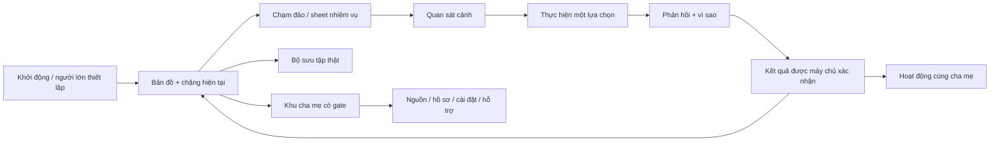

# Workflow riêng cho UI, animation, đồ họa và phát hành mobile của Milo

**Phiên bản:** 1.0 — 27/09/2026. **Trạng thái:** đặc tả và kế hoạch thực hiện; chưa phải thiết kế được chủ dự án chốt hoặc các gate đã đạt.

**Đích sản phẩm:** game học tình huống cho trẻ 7–10 tuổi cùng cha mẹ, có bản sắc Milo, thao tác dễ hiểu và dữ liệu trung thực. **Đích triển khai:** iOS, Android và web dùng chung nội dung/hành vi cốt lõi. **Đích thi:** rèn năng lực tạo prototype đúng đề và đúng công cụ; không cam kết thắng.

Căn cứ thực tế: [26 phát hiện UI và bằng chứng](KIEM-TOAN-UI.md), [số đo trình duyệt](ui-evidence.json), mã nguồn hiện tại và các nguồn chính thức liên kết bên dưới. Kế hoạch này không thay báo cáo đúng đắn dữ liệu, bảo vệ tài khoản hay duyệt nội dung đã có; nó bổ sung phần trải nghiệm và đồ họa còn thiếu.

## 1. Quyết định nền tảng: giữ trò chơi, xây lại cách tương tác

Giữ: Milo, thế giới phiêu lưu, đảo/chặng, đường hành trình, cảnh có chiều sâu, thành tích thật, sự tham gia của cha mẹ. Giữ scoring, attemptId, quyền truy cập, hàng đợi và phiên bản nội dung đã sửa.

Làm lại: thứ bậc thị giác, nhịp học, điều hướng, cách trình bày lựa chọn, liên kết cảnh–hành động–phản hồi, hệ chuyển động và âm thanh. Không coi việc tái dùng một ảnh nhân vật là đã phục hồi toàn bộ UI.

Hướng nghệ thuật đề xuất: **minh họa 2D có lớp chiều sâu**, màu ấm, hình khối rõ, viền/bóng nhất quán, chữ tiếng Việt dễ đọc. Navy dùng cho khung điều hướng; cảnh học dùng bảng màu theo bối cảnh. Một nguồn sáng và quy tắc phối cảnh xuyên suốt. Không dùng emoji hệ điều hành làm tài sản nhận diện chính. Không thêm 3D thật chỉ để trông công nghệ hơn.

Thiết kế phải trả lời bốn câu: đang ở đâu, làm gì tiếp, hành động vừa rồi có tác dụng gì, làm sao quay lại hoặc nhờ giúp. Mỗi màn chỉ có một hành động chính nổi bật. Mọi phần trang trí phải nhường chỗ cho hành động và nội dung.

**Điểm chốt trước triển khai hàng loạt:** trình ba màn cùng hệ nghệ thuật — bản đồ, một cảnh nhiệm vụ, kết quả. Chủ dự án chọn/chỉnh bộ này rồi mới mở rộng. Đây là bước duyệt thiết kế để tránh lặp lại việc tự thay diện mạo; hiện chưa yêu cầu duyệt một mẫu chưa được dựng.

## 2. Tách rõ mục tiêu AI Arena và phát hành ứng dụng

Tài liệu này giả định cuộc thi bạn nói là **AI Arena: Viet Nam 2026 do ĐHQGHN phối hợp Google**. Nếu là cuộc thi khác, phải thay phần này trước khi dùng.

Thông báo ĐHQGHN ghi hạn nhận đăng ký/bài 10/10/2026, chung kết 03/11/2026; tính khả thi 50%, tầm nhìn 30%, sáng tạo 20%. Vì vậy mức độ giải quyết được bài toán và demo hoạt động phải đi trước số lượng hiệu ứng. [Thông báo ĐHQGHN](https://vnu.edu.vn/ai-arena-viet-nam-2026-dau-truong-ung-dung-ai-thuc-chien-danh-cho-sinh-vien-toan-quoc-post40580.html)

Thể lệ quy định sinh viên hợp lệ, đội 2–3 người; thi theo đề BTC, dùng Gemini/AI Studio. Chung kết có đề công bố tại chỗ, thời gian build dự kiến 45–60 phút và pitch tối đa 120 giây. Cấm hỗ trợ trực tiếp ngoài đội trong thời gian thi; BTC có thể yêu cầu log/prompt để xác minh. [Thể lệ](https://ai-arena-vietnam.vnu.edu.vn/the-le)

FAQ còn nêu IDE/coding agent độc lập ngoài môi trường BTC không được dùng trong thời gian thi; phân biệt agent tích hợp AI Studio với IDE độc lập. Công việc Codex hiện tại là chuẩn bị dự án ngoài giờ thi, không tự chứng minh bài nộp hợp lệ. [FAQ chính thức](https://ai-arena-vietnam.vnu.edu.vn/)

Hướng dẫn Audition yêu cầu đọc đề trong hệ thống; mọi đội cùng một đề. Hồ sơ có video, demo, repository và phần mô tả cách dùng Gemini/prompting. Chưa đăng nhập nên chưa biết đề thực tế, giới hạn video và hướng dẫn riêng của biểu mẫu. [Hướng dẫn nộp bài](https://ai-arena-vietnam.vnu.edu.vn/tin-tuc/huong-dan-dang-ky-va-audition)

**Các việc phải xác minh trước nộp:** bạn và đồng đội có đủ điều kiện; đề thật có phù hợp Milo; tài sản/mã/prompt chuẩn bị trước có được tái dùng; phạm vi quy định công cụ ở Audition; yêu cầu đường dẫn và minh chứng cụ thể. Không tự liên hệ BTC hoặc đăng ký thay bạn trong đợt lập workflow này. Không che lịch sử dùng công cụ khác.

Nhánh sản phẩm xây ứng dụng bền vững; nhánh luyện thi dùng kiến thức đã học để dựng luồng theo đề mới trong môi trường cho phép. App lên store không tự mang lại điểm thắng; prototype đúng đề có thể được ưu tiên hơn một app lớn lệch đề.

## 3. Vai trò AI phải được quyết định trước khi thiết kế màn AI

Điều khoản Gemini API hiện nêu yêu cầu 18+ và hạn chế API Client hướng tới hoặc có khả năng được người dưới 18 truy cập. Không thể coi việc đặt nút AI sau một nhãn “cha mẹ” trong cùng ứng dụng trẻ là tự giải quyết điều kiện này. [Gemini API Terms](https://ai.google.dev/gemini-api/terms)

Quyết định đề xuất cho bản đầu: app trẻ chạy cảnh và nội dung đã duyệt; không có chat Gemini trực tiếp, camera chẩn đoán an toàn hoặc đầu vào giọng nói trẻ gửi model. Có thể nghiên cứu một công cụ biên soạn **tách biệt dành cho người lớn**, tạo bản nháp cho chuyên gia xét; cần thẩm định điều khoản và kiến trúc riêng trước triển khai. Không tuyên bố phương án này tự động được Google chấp thuận.

Trong luyện thi, minh chứng AI có thể nằm ở quá trình phân tích yêu cầu, dựng prototype và quy trình tác giả nội dung nếu phù hợp đề. Không bịa có AI thời gian thực trong app chỉ để phần demo hấp dẫn. Nếu đề yêu cầu năng lực AI khác, thiết kế lại bài dự thi theo đề và người dùng được phép, không ép Milo vào mọi đề.

## 4. Cấu trúc màn hình và nhịp chơi mục tiêu

Mất mạng, nội dung thay đổi, chưa có bài và quyền hết hạn là nhánh thiết kế chính thức. Không biến chúng thành thông báo nhỏ ở cuối trang. “Đang lưu”, “đã lưu trên máy”, “đã đồng bộ”, “chưa chấm” phải khác nhau cả nhãn và hình; không cho hiệu ứng nhận thưởng trước biên nhận thật.

### Ma trận màn cần thiết kế

| Mã | Màn / thành phần | Nội dung và hành động chính | Trạng thái phải có | Bằng chứng nghiệm thu |
|---|---|---|---|---|
| S01 | Launch, tải tài nguyên | Nhận diện Milo, chuyển nhanh vào việc cần làm | Lần đầu, cache, lỗi tài nguyên, cập nhật bắt buộc nếu có | Video cold/warm start; không treo logo |
| S02 | Thiết lập người lớn | Chọn hồ sơ, hiểu phạm vi; chỉ xin quyền khi tính năng cần | Mới, quay lại, hết phiên, từ chối, lỗi mạng | Một lần thiết lập hoàn tất, không xin camera mặc định |
| S03 | Bản đồ | Một chặng hiện tại thấy rõ; chọn chương gọn | Chưa học, đang học, hoàn thành, khóa, chưa có bài, tải lỗi | Ảnh và thao tác 320/390/tablet; mở đúng checkpoint |
| S04 | Sheet nhiệm vụ | Tên, mục tiêu ngắn, tiến độ thật, một nút bắt đầu/tiếp tục | Mở mới, có draft, bản đã đổi, chưa tải được | Không ghi đè bài đang làm; đóng sheet quay đúng vị trí |
| S05 | Quan sát cảnh | Minh họa tình huống, lời thoại ngắn, nghe tùy chọn | Ảnh đang tải/lỗi, mất giọng Việt, giảm chuyển động | Trẻ giải thích được ai/ở đâu/điều gì đang xảy ra |
| S06 | Hành động | Một quyết định; điểm chạm/chọn nhân vật/chuỗi hành động | Chưa chọn, đã chọn, xác nhận, chưa biết, dừng | Chơi được bằng chạm và lựa chọn thay thế không kéo |
| S07 | Phản hồi | Thể hiện tác dụng lựa chọn và lý do | Phù hợp, cần xem lại, bỏ qua, nội dung bị rút | Không làm nhục/dọa; không diễn cảnh gây hại chi tiết |
| S08 | Kết quả | Nhận xét cụ thể, tiến độ và thưởng đã xác nhận | Đạt, chưa đạt, pending, retry, kết quả lịch sử | Nộp đôi không nhận thưởng đôi; rõ điểm không là chứng nhận |
| S09 | Bộ sưu tập | Huy hiệu/vật phẩm gắn hành động học thật | Rỗng, đã có, chưa đạt, mất mạng | Đúng childId; không có thành tích khởi tạo giả |
| S10 | Khu cha mẹ | Xem tiến độ, đổi trẻ, nguồn, hoạt động | Chưa có dữ liệu, nhiều trẻ, tải lỗi, hết phiên | Không lẫn hồ sơ; có gate khi quay từ child mode |
| S11 | Tùy chọn trải nghiệm | Giọng, hiệu ứng, rung, giảm chuyển động | Hệ thống bật/tắt, người dùng đổi, lưu thất bại | Tác dụng ngay, giữ sau khởi động, UI khớp engine |
| S12 | Đồng bộ / phục hồi | Bài chờ, xung đột phiên bản, tải bản sao | Offline, gửi lại, lỗi quyền, nội dung đổi | Không mất bài và không báo thành công giả |
| S13 | Hỗ trợ / báo nội dung | Gửi vấn đề dễ hiểu, người lớn xử lý | Gửi, lỗi, có mã tiếp nhận | Không yêu cầu trẻ kể chuyện nhạy cảm trong form |
| S14 | Tài khoản / dữ liệu | Xuất/xóa, đổi thông tin, đăng xuất | Xác thực lại, đang xử lý, lỗi, thành công | Xóa đúng phạm vi; không xóa nhầm khi bấm Back |

Gói đầu không cần trang shop, leaderboard, rương ngẫu nhiên, streak gây áp lực hoặc chat tự do. Bộ sưu tập phục vụ ghi nhận việc học, không tạo vòng ép quay lại. Thời lượng phiên nên có điểm dừng tự nhiên.

## 5. Đặc tả bố cục, chữ và mỹ thuật

### Bản đồ

- Trên điện thoại: HUD gọn, một control đổi chủ đề, bản đồ là vùng trung tâm; dock có tối đa ba đích đã hoạt động. Không xếp ba banner chủ đề lớn trước bản đồ.
- Chặng hiện tại và nút tiếp tục nằm trong vùng nhìn đầu ở 390 × 844 với chữ mặc định; 320 px vẫn vào được chặng mà không phải cuộn qua nhiều khung giới thiệu. Với chữ lớn ưu tiên tác vụ và cuộn hợp lý, không ép vừa bằng thu nhỏ chữ.
- Node của bài là điểm chính; tên và nút chi tiết ở sheet khi chạm, không phải thẻ cao lặp dưới mỗi đảo. Cho chế độ danh sách truy cập được từ một nút để người dùng screen reader không phải hiểu bản đồ không gian.
- Đường đi nối theo tọa độ node thật, đúng thứ tự và trạng thái; không thêm coin/trail khiến người dùng tưởng có tiền thưởng chưa tồn tại. Cảnh xung quanh không che điểm chạm.
- Chỉ render chương cần xem và tài nguyên lân cận. Khi quay từ bài, khôi phục chương/vị trí cuộn; không bắt về đầu hành trình.

### Cảnh học

Một khung cảnh, một nhiệm vụ, một nhóm lựa chọn. Không đặt banner nhân vật + card mục tiêu + card chuyện + card nguồn + câu hỏi thành bài viết dài. Lời giải và nguồn không phải nội dung cần chiếm màn hình trước khi chơi; nguồn chuyển vào khu người lớn.

**Lát cắt H01 đề xuất:** phòng khách → An muốn lấy sách gần cốc nóng → trẻ chọn nhờ người lớn thay vì với qua cốc → nhân vật người lớn hỗ trợ trong hoạt cảnh ngắn → lời giải → kết quả → gợi thực hành bằng tranh. Không cho trẻ thao tác di chuyển cốc nóng như nhiệm vụ đạt điểm. Nội dung minh họa cũng phải được duyệt, không chỉ phần chữ.

Trò chơi dùng ba mẫu có thể mở rộng: chọn hành động trong cảnh; chọn người/vị trí trợ giúp trong bối cảnh được duyệt; sắp xếp bước bằng chạm với kéo-thả tùy chọn. Không dùng phản xạ đếm ngược cho bài ranh giới cơ thể hoặc tìm trợ giúp. Chưa tự triển khai các mẫu trong lần lập workflow này.

### Token và thành phần

| Hệ thống | Quy tắc đề xuất | Sản phẩm bàn giao |
|---|---|---|
| Màu | Vai trò surface/text/action/feedback/disabled; từng biome vẫn cùng cấu trúc | Bảng token có kiểm tra tương phản |
| Chữ | 1 họ chữ có tiếng Việt đầy đủ và quyền dùng; body khởi điểm 18, heading 22–28; kiểm tra dấu, xuống dòng, chữ lớn | Font specimen và fallback theo nền tảng |
| Khoảng cách | Thang 4/8/12/16/24/32; không căn bằng margin ngẫu nhiên | Token spacing/layout |
| Hình khối | 2–3 cấp bo góc, viền, bóng; cùng hướng sáng | Bảng component thường/nhấn/khóa/lỗi |
| Vùng chạm | Mục tiêu nội bộ ≥48 đơn vị logic, thêm khoảng cách; không lấy kích thước nét icon làm vùng chạm | Overlay hitbox khi QA |
| Icon | Một bộ nhất quán; nhãn chữ cho chức năng chính; SVG có semantic hoặc decorative | Danh mục icon và cách gọi tên |
| Nhân vật | Một model sheet, tỷ lệ, màu, trang phục, góc mặt; không trộn ảnh khác thiết kế | Sheet Milo và quy tắc biểu cảm |
| Thành phần | GameHUD, ChapterSelector, MapNode, MissionSheet, SceneStage, DialogueBubble, ChoiceTile, FeedbackPanel, RewardSummary, ParentGate, SyncBanner, SettingsRow | Bộ ví dụ mọi trạng thái trên cả ba nền tảng |

Những con số ở đây là mục tiêu thiết kế khởi đầu, không phải ngưỡng bắt buộc của mọi store. Kiểm tra vùng chạm và nhãn theo khả năng truy cập của nền tảng. [Android accessibility](https://developer.android.com/guide/topics/ui/accessibility/apps)

## 6. Hệ chuyển động: mỗi hiệu ứng phải có ý nghĩa

Nguyên tắc đối chiếu Apple: chuyển động hỗ trợ trạng thái và phản hồi, ngắn gọn, có thể giảm/tắt, không bắt người dùng chờ hiệu ứng lặp. [Apple Motion](https://developer.apple.com/design/human-interface-guidelines/motion)

Các thời gian sau là **đề xuất của dự án**, cần thử và điều chỉnh; không gán cho Apple/Google.

| Motion | Trigger và ý nghĩa | Thời gian đề xuất | Khi tắt/giảm chuyển động | Điều kiện kết thúc |
|---|---|---:|---|---|
| Nút bấm | Xác nhận đã nhận chạm | 80–120 ms | Đổi nền/viền | Hủy nếu drag khỏi vùng hoặc mất focus |
| Sheet | Mở chi tiết đúng node | 180–240 ms | Hiện trực tiếp/fade nhẹ | Back/swipe đóng không mắc khóa |
| Chuyển cảnh | Giữ liên hệ từ bản đồ sang nhiệm vụ | 220–300 ms | Cắt cảnh với tiêu đề rõ | Có thể bỏ qua, không phụ thuộc API |
| Milo idle | Tạo cảm giác nhân vật sống | Nháy mắt/thở nhẹ theo nhịp thưa | Tư thế tĩnh | Dừng khi khuất, background, màn đọc dài |
| Milo chỉ dẫn | Hướng tới thao tác liên quan | 300–500 ms một lượt | Mũi tên/nhãn tĩnh | Không vẫy lặp vô hạn yêu cầu bấm |
| Chọn đáp án | Hiển thị đang chọn | 100–160 ms | Viền, dấu chọn và nhãn | Khóa sau xác nhận, không nộp do kết thúc animation |
| Phản hồi đúng | Xác nhận hành động phù hợp | 350–600 ms | Icon + câu giải thích | Một lượt, không cản đọc tiếp |
| Cần xem lại | Gợi thử hiểu lại | 120–200 ms fade | Nhãn trung tính | Không rung giật màn hoặc còi báo động |
| Mở chặng | Tiến độ mới đã xác nhận | 500–800 ms | Đổi trạng thái node | Chỉ sau dữ liệu thật, phát một lần |
| Nhận huy hiệu | Ghi nhận đủ điều kiện | 600–900 ms | Huy hiệu và lời giải thích | Bỏ qua được; idempotent khi replay |
| Đang tải | Hệ thống còn xử lý | Động nhẹ nếu cần | Nhãn trạng thái | Timeout có đường xử lý, không loop vô hạn giả |

Mỗi animation cần hồ sơ: ID, owner, thành phần, trigger, guard, interrupt, cleanup, chế độ tĩnh, âm/rung liên quan, thời lượng, thiết bị đã đo, video bằng chứng. Không có hồ sơ thì chưa đưa vào bản phát hành.

**Máy trạng thái Milo đề xuất:** idle → guiding / listening / thinking → encouraging / explaining → idle; nghỉ khi paused. “Listening” chỉ dùng khi ứng dụng thực sự tiếp nhận thao tác/âm thanh được phép, không tạo ảo giác đang nghe microphone. Thinking không được kéo dài giả để trông giống AI. Phản hồi sai không dùng biểu cảm làm trẻ xấu hổ.

**Vòng đời:** focus + foreground + visible + preference cho phép mới chạy loop. Cancel timer, sequence, sound và vibration khi blur/unmount/background. Khi trở lại, đọc trạng thái nghiệp vụ rồi render, không tự phát lại phần thưởng hoặc giọng nói. Có bài kiểm tra đổi màn 20 lần và background/resume.

## 7. Âm thanh, giọng nói và haptics

Tạo một bộ điều khiển trải nghiệm chung; UI phát sự kiện có ý nghĩa, không gọi rải rác oscillator/haptic/timeout. Âm thanh, voice và haptics có adapter riêng web/iOS/Android nhưng dùng cùng chính sách.

- Tách bốn lựa chọn: giọng đọc, hiệu ứng, nhạc nền nếu có, rung. Không coi tắt giọng là đã tắt toàn bộ âm. Lưu tùy chọn và hiển thị khi lưu thất bại.
- Không autoplay giọng trẻ chưa chọn. Có replay/stop và chữ tương đương; thiếu giọng Việt thì báo nhẹ, vẫn học được.
- Ưu tiên một luồng giọng; giảm/dừng hiệu ứng khi voice phát; không chồng lời từ màn cũ. Kiểm tra silent mode, tai nghe, cuộc gọi, khóa máy và audio focus.
- Haptics nhẹ để xác nhận thao tác; không dùng rung mạnh mô phỏng điện giật/nguy hiểm. Không dùng âm hoặc rung làm thông tin duy nhất.
- Tài sản âm thanh/giọng thu có người tạo, quyền dùng, phiên bản và đối chiếu với bài. Không sao chép âm hiệu của game khác.

## 8. Pipeline tài nguyên đồ họa

Luồng: brief nội dung → storyboard → duyệt cách thể hiện → asset gốc → xuất biến thể → kiểm tra thiết bị → version → gắn vào scene → kiểm tra lại. Không tạo cả bộ tranh trước khi chốt model sheet.

| Nhóm | Gói đầu đề xuất | Điều kiện nghiệm thu |
|---|---|---|
| Milo | 1 model sheet; 6 trạng thái dùng thật; ảnh tĩnh dự phòng | Không đổi tỷ lệ/khuôn mặt giữa tư thế; cạnh sạch trên sáng/tối |
| Thế giới | 3 theme chủ đề; nền trước/giữa/sau; node khóa/mở/đạt/đang học | Mỗi chủ đề nhận ra được, cùng phối cảnh và điểm chạm |
| Bài học | 1 cảnh hoàn chỉnh trước; sau đó tối đa 12 cảnh bám 12 bài | Đồ vật/người đúng nội dung, không che thông tin an toàn |
| Phản hồi | Dấu chọn, xem lại, pending, huy hiệu, mở chặng | Không chỉ dựa màu; mỗi icon có ý nghĩa ổn định |
| Hệ thống | Empty/error/offline/update/permission | Không vẽ trạng thái thành công khi thực tế thất bại |
| Phát hành | Icon, adaptive icon, splash, ảnh store, poster/video demo | Cùng nhận diện; ảnh từ chức năng thực sự chạy |

Sổ tài nguyên bắt buộc: assetId, tác giả/nguồn, bằng chứng quyền, giấy phép font/âm, file gốc, ngày, phiên bản, kích thước/dung lượng, alt text, nội dung cần duyệt, nơi dùng, bản fallback. Prompt tạo ảnh không tự chứng minh quyền dùng mọi yếu tố trong ảnh. Hồ sơ mascot cũ hiện chưa đủ; chủ dự án cần bổ sung nguồn hoặc đặt làm một thiết kế có quyền rõ.

Ưu tiên SVG đơn giản cho icon/nút/đường đi; raster cho tranh có texture, kích thước phù hợp màn và alpha sạch. Đo decode/memory chứ không chỉ KB tải xuống. Chỉ cài runtime hoạt hình mới sau spike; không gộp Rive, Lottie, Skia và engine game chỉ vì từng thư viện đẹp.

## 9. Kiến trúc thực hiện và native spike

Giữ React Native/Expo hiện có làm điểm xuất phát, không viết lại engine khi chưa có bằng chứng cần. Tách ba lớp:

1. **Learning domain:** bài, câu hỏi, đáp án, phiên bản, attempt, quyền và kết quả — không phụ thuộc animation.
2. **Scene player:** nhận dữ liệu đã duyệt, phát sự kiện chọn/xác nhận/bỏ qua; có bản thao tác không kéo.
3. **Presentation:** renderer cảnh, Milo, transition, audio/haptic, accessibility. Thay renderer không đổi đáp án hay XP.

Mapping bắt buộc sceneId → lessonId → checkpointId → questionId/optionId → contentVersion. Tọa độ hoặc thứ tự hình không được quyết định đáp án. Khi thay hình mang ý nghĩa, cần đổi version nội dung/duyệt tương ứng. Asset không tải được thì có trạng thái khôi phục; không cho người học đoán một hình bị mất.

Animation transform/opacity cơ bản có thể dùng Animated hiện tại; chọn native driver khi thuộc tính và nền tảng hỗ trợ. Đo ở bản release, vì hiệu năng dev không đại diện release. [React Native performance](https://reactnative.dev/docs/performance)

Nếu cần rig nhân vật: spike **một** runtime ứng viên với một nhân vật và ba state; đo startup, memory, chuyển trạng thái, pause, web fallback và build iOS/Android. Chỉ chốt sau khi so với giải pháp nhẹ sẵn có. Không ấn định package/version khi chưa kiểm tra tương thích SDK mục tiêu.

Repo đang ở Expo 52/RN 0.76.9. Lập nhánh nâng có snapshot; nâng từng SDK và kiểm tra release notes/phụ thuộc, không nâng đồng loạt. Dùng development build để thử native; web export hoặc Expo Go không là bằng chứng bản store. iOS local cần môi trường macOS/Xcode; có thể cân nhắc cloud build nhưng vẫn cần ký và thiết bị thử. [Nâng Expo SDK](https://docs.expo.dev/workflow/upgrading-expo-sdk-walkthrough/), [Development builds](https://docs.expo.dev/develop/development-builds/introduction/)

Spike native phải trả lời: safe area/notch, Android Back/predictive back theo target, bàn phím, insets/edge-to-edge, layout tablet/rotation, native audio, secure session/storage, API HTTPS, resume, draft, queue, asset bundle, quyền từ chối. Các gói camera/notifications không dùng phải được kiểm kê trong binary/manifest, không chỉ ẩn nút.

## 10. Các chặng thực hiện và điều kiện qua chặng

Ước lượng sau đây là ngày công tập trung cho nhóm nhỏ có người thiết kế, lập trình và kiểm thử; có thể kiêm vai. Các hàng có phần song song, không cộng máy móc và không gồm thời gian chờ chuyên gia, tài khoản, xét store. Chốt lại sau V0/V1.

| Chặng | Công việc | Chủ trì | Đầu ra cụ thể | Gate | Ước lượng sơ bộ |
|---|---|---|---|---|---|
| V0 — Baseline | Chốt trải nghiệm cần giữ, ảnh cũ/mới cùng viewport, route thật, danh sách lỗi và phạm vi cuộc thi | Chủ sản phẩm + UX + kỹ thuật | Brief, snapshot, backlog ID, thước đo baseline | Không còn nhầm “có file” với “đang chạy”; rõ phần phải giữ | 1–2 ngày |
| V1 — Nền tảng | Spike một màn native, kiểm kê asset/quyền, chọn hướng công nghệ | Kỹ thuật + art | Build thử, ma trận phụ thuộc, sổ asset | Có đường build iOS/Android thực tế; runtime được chọn có căn cứ | 2–4 ngày, song song V2 |
| V2 — Thiết kế hệ thống | Art direction, model sheet, token, wireflow, ba keyframe, motion storyboard | UX/art + chủ sản phẩm | Bộ thiết kế có nhận xét và phiên bản | Chủ dự án chốt bộ ba màn; không thay phong cách tùy tiện | 3–5 ngày |
| V3 — Lát cắt game | H01 từ bản đồ → cảnh → hành động → lời giải → lưu → quay bản đồ | Kỹ thuật + UX + nội dung | Prototype chạy, trạng thái lỗi/pending, video | Dữ liệu thật trong môi trường giả; người lớn hiểu và thao tác được | 4–7 ngày |
| V4 — Motion/audio | Milo state, transition, preferences, tắt nền, âm native, accessibility | Kỹ thuật + motion | Motion catalog, controller, video normal/reduced | Dừng đúng vòng đời; không chặn thao tác hoặc nhân thưởng | 3–5 ngày |
| V5 — Mở rộng | Áp mẫu cho 12 bài, bộ sưu tập, khu cha mẹ, phục hồi dữ liệu | Kỹ thuật + nội dung + art | Ma trận S01–S14 chạy, mỗi bài có cảnh đúng | Không có màn thiếu trạng thái; không đưa bài chưa duyệt cho gia đình | 5–10 ngày |
| V6 — Nghiệm thu | Thiết bị thật, trợ năng, pin/perf, thử dùng được phép, sửa P0/P1 | QA + chủ sản phẩm | Biên bản, trace, ảnh/video, danh sách còn mở | Không P0; P1 luồng chính đã sửa; người dùng đạt mục tiêu nội bộ | 3–7 ngày và thời gian tuyển |
| V7 — Phát hành | Icon/splash/store, tài khoản ký, privacy, beta, tài liệu hỗ trợ/rollback | Chủ sản phẩm + kỹ thuật | Bản ký, TestFlight/Play testing, hồ sơ nộp | Đạt gate sản phẩm và các yêu cầu hiện hành; store chưa duyệt thì chưa công bố đã lên | Theo điều kiện ngoài dự án |
| C — Luyện thi | Dựng theo đề mẫu mới bằng công cụ cho phép, diễn tập pitch/Q&A | Đội thi hợp lệ | Log luyện tập, demo đúng đề, hồ sơ nguồn | Đủ điều kiện và minh chứng BTC yêu cầu; không có gate “chắc thắng” | Chạy riêng theo hạn thi |

Đường găng sản phẩm: V0 → V2 → V3 → V4/V5 → V6 → V7; V1 phải xong trước khi mở rộng hiệu ứng native. Nếu lát cắt chưa đạt, quay V2/V3, không nhân lỗi sang 12 bài. Nếu thiếu chuyên gia, giữ nhánh nội bộ cho người lớn, không tự cho trẻ thử nội dung nhạy cảm.

## 11. Backlog ưu tiên để bắt đầu ngay sau chốt thiết kế

| Ticket | Phụ thuộc | Việc làm và phạm vi file dự kiến | Tiêu chí đóng |
|---|---|---|---|
| UI-01 | V0 | Chốt route active/legacy tại `AppNavigator` và ownership các màn | Bảng route có owner; không xóa asset gốc |
| UI-02 | UI-01 | Thiết kế lại HUD/map/sheet thay cấu trúc thẻ trong `GameJourney` | Thấy chặng hiện tại; sheet mở đúng ID; ảnh cùng viewport |
| UI-03 | UI-02 | Tìm kiếm, tiếp tục, pending trong `LearningFlow` | Không nằm dưới toàn bộ bản đồ; tìm xuyên chủ đề đúng |
| UI-04 | V2 | Một hệ token và component, thay hard-code có kiểm soát | Chọn một token đổi đúng cả màn, không đổi logic |
| UI-05 | V2 + nội dung | Storyboard H01, scene graph và thao tác | Một quyết định trong cảnh; có cách chơi bằng chạm đơn |
| UI-06 | UI-05 | Tách phần đọc/câu hỏi/phản hồi trong `LearningFlow` và `LessonGuide` | Không còn chuỗi card dài trước lựa chọn; giữ draft/retry |
| UI-07 | UI-05 | Hợp đồng scene/asset/version | Đảo vị trí hình không đổi đáp án; thay ý nghĩa hình phải duyệt lại |
| UI-08 | V1/V2 | Chọn một Milo renderer, hợp nhất state | 6 trạng thái nhất quán; không gọi nhiều engine trùng |
| UI-09 | UI-08 | Motion lifecycle cho `BiomeBackground` và nhân vật | Blur/background dừng; 20 vòng mở/đóng không tăng hoạt động tồn dư |
| UI-10 | V1 | Audio/haptic native và preferences chung | Tắt âm/rung đúng toàn app; không phát từ màn đã đóng |
| UI-11 | UI-06 | Kết quả, collection, unlock animation | Chỉ dùng receipt/ledger; retry không nhân hiệu ứng thưởng |
| UI-12 | UI-04 | Parent gate, nguồn/link ngoài, navigation trở lại | Nhãn “cha mẹ” không thay gate; hủy gate giữ child mode |
| UI-13 | UI-04 | Error/loading/empty/offline qua S01–S14 | Mỗi lỗi có hành động phục hồi, không mất dữ liệu |
| UI-14 | V1 | Safe area, Back, tablet, keyboard, native session | Biên bản iOS/Android thật hoặc ghi rõ chưa thử |
| UI-15 | V2 | Sổ asset, icon/splash, cắt/nén/xuất biến thể | Quyền có hồ sơ; không mờ, crop sai hoặc khác mascot |
| UI-16 | UI-05/07 | Chuyển minigame cũ sang nội dung/version chung | Không bật nội dung hard-code chưa duyệt; accessibility tương đương |
| UI-17 | V5 | Profiling và tối ưu theo trace | Đo trước/sau cùng thiết bị/build/kịch bản, không claim từ cảm giác |
| UI-18 | V6 | Beta, store assets, demo và release notes | Hình quảng bá khớp app; hồ sơ nộp trung thực |

Mỗi ticket lưu: ảnh/video trước, hành vi mong muốn, thiết kế trạng thái, owner/reviewer, phụ thuộc, test phù hợp, bằng chứng sau, phạm vi bị ảnh hưởng, cách rollback. Rollback presentation không hạ schema hoặc xóa tiến độ. Chỉ dùng feature flag khi cả hai renderer nhận cùng dữ liệu/hợp đồng; tránh duy trì hai đường chấm điểm.

## 12. Nghiệm thu đồ họa, tương tác và hiệu năng

Tất cả ngưỡng dưới đây là **mục tiêu nội bộ đề xuất**, chưa phải kết quả đo hiện tại hoặc luật của store.

| Mã | Bài kiểm tra | Kết quả mong muốn |
|---|---|---|
| G01 | Mở map 390 × 844, chữ mặc định | Nhìn thấy chặng hiện tại và cách bắt đầu trước khi cuộn |
| G02 | 320 px và chữ 200% | Không cắt nội dung/nút, không chồng hitbox; được phép cuộn |
| G03 | 768/1024 và desktop | Cảnh không bị kéo méo, chữ không thành dòng quá dài; thao tác đủ |
| G04 | Safe area/notch/gesture bar/keyboard | Không che CTA/dock; focus và scroll giữ được |
| G05 | Tìm một bài ở chủ đề khác | Kết quả đúng, nhảy đúng node; nêu rõ điều kiện nếu khóa |
| G06 | Touch, keyboard, VoiceOver/TalkBack | Có nhãn/thứ tự focus; modal không để focus lạc; có cách chơi tương đương |
| G07 | Giảm chuyển động + tắt mọi âm/rung | Tác vụ vẫn hiểu và hoàn thành được; lựa chọn được lưu |
| G08 | Mở/đóng 20 lần; background/resume 10 lần | Không còn speech/loop cũ; không tăng timer/listener không giải phóng |
| G09 | Ảnh tải lỗi/cache cũ | Placeholder có nghĩa; không chấm bài dựa ảnh mất; retry rõ |
| G10 | Nộp hai lần, timeout, quay lại kết quả | Một receipt và thưởng; thông báo pending khác completed |
| G11 | Nội dung bị rút/đổi version | Không phát lại lời khuyên/hoạt cảnh cũ; có thông báo trung thực |
| G12 | Hai hồ sơ trẻ, đăng xuất, vào lại | Đúng tiến độ, collection và dữ liệu; không rò hồ sơ |
| G13 | Chọn sai/bỏ qua liên tiếp | Không khen thành thạo, không trừng phạt cảm xúc; vẫn có lời giải |
| G14 | Một bộ 10–20 gia đình sau duyệt | Mục tiêu 8/10 hoàn thành luồng cơ bản không cần kỹ thuật viên; ghi đúng mẫu và cách thử |
| G15 | Hình/âm/nguồn store | Có hồ sơ nguồn, không asset mất nét/crop sai/claim chưa có |
| G16 | Lát cắt AI nếu được làm và phù hợp điều khoản | Log minh chứng thật; lỗi không giả thành công; dữ liệu giả được ghi rõ |

**Bộ thiết bị tham chiếu cần chốt:** một Android cấu hình thấp 3–4 GB RAM, một Android phổ biến, một iPhone màn nhỏ và một iPhone hiện hành; thêm iPad/tablet nếu còn khai báo hỗ trợ. Ghi model, OS, build hash và cài đặt. Không cần mua mọi máy: có thể mượn/thuê hoặc dùng lab, nhưng phải ghi phạm vi thật.

**Cách đo:** release build, phiên thử 10 phút gồm map/cuộn/mở cảnh/làm bài/resume; lặp ba lần. Ghi thời gian phản hồi chạm, thời gian tới màn dùng được, frame-time/jank, memory trước/sau, crash, nhiệt/pin. Dùng công cụ profiling nền tảng phù hợp, lưu trace. Cold start và warm start tách riêng.

Mục tiêu khởi đầu: phản hồi hiển thị sau chạm p95 dưới 100 ms khi không phụ thuộc mạng; điều hướng đơn giản dưới 300 ms sau khi dữ liệu sẵn; cold start tới trạng thái dùng được dưới 3 giây trên thiết bị tham chiếu sau cài. Màn game nhẹ nhắm 60 fps; không tự gán đạt nếu chưa đo, máy yếu có chế độ ít hiệu ứng. Memory sau warm-up/20 vòng không tăng đơn điệu không giải phóng. Không đặt phần trăm pin chung khi chưa biết thiết bị và độ sáng.

Ngân sách đồ họa ban đầu: tối đa hai nguồn chuyển động môi trường đồng thời, giảm particle trên máy yếu, không preload cả 12 cảnh nếu không cần, không decode nhiều ảnh cỡ lớn để hiển thị thumbnail. Chốt giới hạn KB/texture sau một scene benchmark, tránh con số tùy ý làm xấu tranh.

## 13. Gate iOS/Android và hồ sơ store

Đây là checklist thực hiện, không phải xác nhận ứng dụng đã đủ điều kiện hoặc chắc được duyệt.

- Build ký riêng iOS/Android; kiểm tra bundle/package, version, môi trường API và tài khoản reviewer. Phân biệt development, beta, production; có rollback app/content.
- Kiểm tra icon/splash trên máy thật, Android adaptive mask, nền sáng/tối; ảnh chụp store đúng bản đang chạy, không dùng concept như ảnh sản phẩm.
- Hoàn thiện policy, hỗ trợ, xuất/xóa dữ liệu và rating theo nội dung thật. Rà toàn bộ SDK/permission/telemetry trong binary, kể cả tính năng bị ẩn.
- Nếu chọn Kids Category, Apple đặt yêu cầu với link ngoài và khu có parental gate; bản beta dùng TestFlight, không gọi bản demo là app hoàn thiện. [Apple Review Guidelines, mục 1.3 và 2](https://developer.apple.com/app-store/review/guidelines/)
- Google Play yêu cầu khai báo đúng nhóm tuổi, dữ liệu và SDK phù hợp; đồ họa hướng trẻ cũng ảnh hưởng đánh giá đối tượng. [Google Play Families](https://support.google.com/googleplay/android-developer/answer/9893335)
- Đối chiếu target API, SDK build tối thiểu, privacy manifest và các yêu cầu kỹ thuật hiện hành **tại thời điểm nộp**. Không lấy cấu hình Expo hiện tại làm bảo đảm đạt.
- Chất lượng Android còn gồm vòng đời, thay đổi cấu hình và trải nghiệm nhất quán. [Core app quality](https://developer.android.com/docs/quality-guidelines/core-app-quality)

Các dependency ngoài UI: người duyệt nội dung thật; chủ sở hữu tài khoản Apple/Google; người trực hỗ trợ; chính sách và ngân sách vận hành; thiết bị và quyền tài sản. Thiếu mục nào ghi CHƯA ĐẠT, không giao cho AI tự xác nhận.

## 14. Kế hoạch luyện thi và trình diễn

**Kế hoạch đề xuất từ 27/09, không phải lịch BTC:**

| Khoảng thời gian | Mục tiêu |
|---|---|
| 27–28/09 | Đọc đề thực tế/tư cách; chốt game direction; quyết định Milo có phù hợp đề không |
| 29/09–02/10 | Một lát cắt chất lượng; thực hành dựng lại luồng nhỏ bằng môi trường cho phép |
| 03–06/10 | Thử lỗi, soát asset, ghi rõ vai trò AI; diễn tập trên một đề khác để tránh học thuộc |
| 07–09/10 | Rà yêu cầu biểu mẫu, video/demo/repository, kiểm tra quyền truy cập và tính nguyên gốc; để đệm trước hạn |
| Sau đó nếu vào vòng sau | Luyện tạo prototype từ đề mới và pitch; tiếp tục native theo đường sản phẩm riêng |

Nếu nguồn lực không đủ, thu phạm vi prototype xuống một bài có chất lượng; không hứa kịp hoàn thiện app store trước hạn. Chỉ thực hiện kế hoạch thi sau khi xác minh điều kiện và đề phù hợp.

**Khung pitch luyện tập 120 giây do dự án đề xuất:** 0–15 giây nêu người dùng/vấn đề; 15–65 giây thao tác một luồng đúng đề; 65–90 giây chứng minh AI/công cụ đã đóng góp gì; 90–110 giây nêu bằng chứng khả thi và cách mở rộng; 110–120 giây giới hạn và bước tiếp. Không nói “trẻ an toàn hơn X%” khi chưa nghiên cứu.

**Bảng tự chấm nội bộ:**

| Mục | Câu hỏi để tự kiểm tra | Bằng chứng |
|---|---|---|
| Khả thi | Người khác tự mở và chạy được đúng bài toán không? | Demo thật, trạng thái lỗi, chỉ dẫn ngắn |
| Tầm nhìn | Ai dùng, giá trị gì, phần nào đã/chưa được kiểm chứng, mở rộng bằng cách nào? | Hành trình người dùng, kế hoạch nội dung/vận hành, giới hạn |
| Sáng tạo | AI thay đổi công việc hoặc trải nghiệm cụ thể nào? | So sánh quy trình, prompt/log được phép, kết quả có thể đối chiếu |

Tự chấm không dự đoán thứ hạng. Không dùng video quay sẵn như bằng chứng live đang chạy; nếu cần fallback phải giới thiệu rõ và chỉ dùng khi thể lệ cho phép. Không nhận trợ giúp thời gian thực từ Codex trong phần thi cấm công cụ/hỗ trợ ngoài đội.

## 15. Definition of Done và bước tiếp theo

Một hạng mục UI chỉ đóng khi: đúng hành vi/dữ liệu; thiết kế đã chốt; đủ trạng thái; chữ/ảnh/âm có nguồn; trợ năng và giảm chuyển động hoạt động; lỗi và interruption không mất tiến độ; có ảnh/video cùng viewport và test phù hợp; có rollback; giới hạn còn lại được ghi rõ. Không viết test hình thức cho mỗi đổi màu; dùng ảnh so sánh và kiểm tra bằng mắt cho phần thị giác, test hành vi cho phần tương tác/dữ liệu.

Bước thực hiện đầu tiên là **V0/V2: brief giữ chất game gốc và bộ ba keyframe bản đồ–nhiệm vụ–kết quả**, đồng thời V1 kiểm tra đường native. Chưa vẽ/xây hàng loạt và chưa bật lại minigame cũ. Sau khi bộ ba được chốt, làm một lát cắt H01 từ đầu đến cuối rồi mới nhân rộng.

Những việc tôi có thể tiếp tục trong workspace: đặc tả, thiết kế component/scene, mã UI, animation, adapter, kiểm tra tự động, tài liệu và chuẩn bị build. Những việc chưa thể tự thay bạn: xác nhận chuyên môn, chứng minh quyền asset không có hồ sơ, thử trẻ/thiết bị không sẵn có, tài khoản ký/phát hành, tư cách dự thi và quyết định của BTC/store. Không có workflow nào bảo đảm thắng cuộc thi hoặc không bao giờ phát sinh lỗi.
